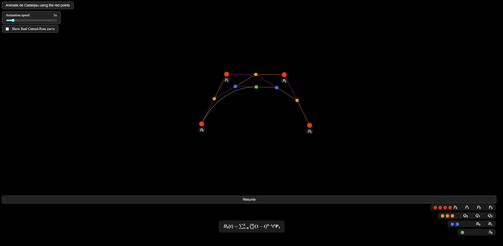

# Алгоритъм на дьо Кастелжо: Математическо описание

Алгоритъмът на дьо Кастелжо е числено стабилен, рекурсивен метод за изчисляване на полиноми във форма на Бернщайн, най-често използван за криви на Безие. Той е фундаментален в компютърната графика за оценка, разделяне и рендериране на криви.

## Криви на Безие и форма на Бернщайн
Крива на Безие от степен $n$ с контролни точки $\beta_0, \ldots, \beta_n$ може да се запише във форма на Бернщайн така:

$$
B(t) = \sum_{i=0}^n \beta_i b_{i,n}(t), \quad t \in [0,1]
$$

където $b_{i,n}(t)$ са базисните полиноми на Бернщайн:

$$
b_{i,n}(t) = \binom{n}{i} (1-t)^{n-i} t^i
$$

## Рекурсивна дефиниция (алгоритъм на дьо Кастелжо)
Дадени контролни точки $\beta_0, \ldots, \beta_n$, алгоритъмът рекурсивно изчислява нови точки по следния начин:

- Задава $\beta_i^{(0)} := \beta_i$ за $i = 0, \ldots, n$.
- За $j = 1, \ldots, n$ и $i = 0, \ldots, n-j$:

$$
\beta_i^{(j)} := (1-t) \beta_i^{(j-1)} + t \beta_{i+1}^{(j-1)}
$$

- Стойността на кривата на Безие при $t$ е $B(t) = \beta_0^{(n)}$.

Този процес изисква $\mathcal{O}(d n^2)$ операции за крива от степен $n$ в $d$-мерно пространство.

## Геометрична интерпретация
Геометрично, алгоритъмът на дьо Кастелжо конструира последователност от контролни многоъгълници:

1. Започва с оригиналните контролни точки $P_0, \ldots, P_n$.
2. За всяко $k = 1, \ldots, n$ се формира нов набор от точки чрез линейна интерполация между последователни точки от предишния набор, използвайки съотношението $t : (1-t)$.
3. Процесът се повтаря, докато остане само една точка; това е $B(t)$, точката на кривата при параметър $t$.

Този процес може да се визуализира, като използвате бутона `Animate de Casteljau using the red points`, който показва всеки контролен полигон от съответното ниво с различен цвят точки. <br>
Също показва как кривата се създава, докато увеличаваме $t$.



## Разделяне и сплитване
Алгоритъмът на дьо Кастелжо не само изчислява $B(t)$, но и предоставя контролните точки за двете под-криви, получени при разделяне на оригиналната крива на Безие при $t$.

- Лявата под-крива има контролни точки $\beta_0^{(0)}, \beta_0^{(1)}, \ldots, \beta_0^{(n)}$.
- Дясната под-крива има контролни точки $\beta_0^{(n)}, \beta_1^{(n-1)}, \ldots, \beta_n^{(0)}$.

## Пример (Квадратична крива на Безие)
Дадени контролни точки $\beta_0, \beta_1, \beta_2$ и параметър $t$:

- Първа итерация:
  - $\beta_0^{(1)} = (1-t)\beta_0 + t\beta_1$
  - $\beta_1^{(1)} = (1-t)\beta_1 + t\beta_2$
- Втора итерация:
  - $\beta_0^{(2)} = (1-t)\beta_0^{(1)} + t\beta_1^{(1)}$

Точката $B(t) = \beta_0^{(2)}$ лежи на кривата при $t$.

## Алгоритъм (Пример на JavaScript от нашия код)
Дадени контролни точки (масив от THREE.Vector3) и параметър t, функцията за de Casteljau изглежда така:

```js
function deCasteljau(controlPoints, t) {
    if (!controlPoints || controlPoints.length === 0) return null;
    let points = controlPoints.map((point) => point.clone());
    while (points.length > 1) {
        const nextPoints = [];
        for (let i = 0; i < points.length - 1; i++) {
            const interpolatedPoint = points[i].clone().lerp(points[i + 1], t);
            nextPoints.push(interpolatedPoint);
        }
        points = nextPoints;
    }
    return points[0];
}
```

Тази функция връща точката на кривата на Безие при даден t, използвайки същата рекурсивна схема, описана по-горе.

## Числена стабилност и приложения
Алгоритъмът на дьо Кастелжо се предпочита пред директното изчисляване на полинома на Бернщайн поради по-добрата си числена стабилност, особено за криви с висока степен. Използва се и за разделяне на криви, рендериране и алгоритми за пресичане в компютърната графика.

## Източници
- [Wikipedia: De Casteljau's algorithm](https://en.wikipedia.org/wiki/De_Casteljau%27s_algorithm)
