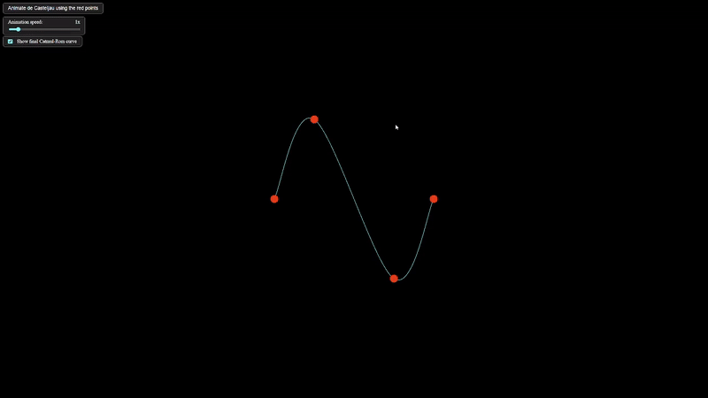

# Ръководство за потребителя: Визуализация на криви (Catmull-Rom и Безие)

## Какво представлява приложението?
Това приложение ви позволява да създавате, изследвате и анимирате интерполиращи криви Catmull-Rom и Безие. Можете да добавяте, местите и премахвате контролни точки, да наблюдавате анимации на алгоритъма на дьо Кастелжо и да виждате формулите и етапите на построяване в реално време.

---

## Основни функции

- **Добавяне на контролни точки:** Кликнете върху платното, за да добавите нова контролна точка.
- **Местене на точки:** Задръжте и плъзнете съществуваща точка с мишката или с пръст (на мобилно устройство).
- **Премахване на точки:** Натиснете `Ctrl+Z` (или `Cmd+Z` на Mac), за да премахнете последната добавена точка.
- **Анимация на de Casteljau:** Натиснете бутона `Animate de Casteljau using the red points`, за да видите стъпките на алгоритъма за текущите точки.
- **Пауза:** Използвайте бутона `Pause` (долу вдясно), за да спрете временно анимацията на de Casteljau. Бутонът е активен само по време на тази анимация.
- **Скорост на анимация:** Регулирайте плъзгача `Animation speed`, за да ускорите или забавите анимациите.
- **Показване/скриване на кривата:** Използвайте отметката `Show final Catmul-Rom curve`, за да скриете или покажете крайната крива.
- **Контекстно меню:** С десен клик върху контролна точка се появява меню за анимиране на Catmull-Rom сегмент (построяване на Безие контролните точки за сегмента и самия сегмент между текущата и следващата точка).

---

## Стъпки за работа

1. **Добавете няколко контролни точки** чрез клик върху платното.
2. **Преместете точки** за да промените формата на кривата.
3. **Анимирайте алгоритъма на дьо Кастелжо** с бутона горе вляво.
4. **Използвайте контекстното меню** (десен клик върху точка), за да видите анимация на Catmull-Rom сегмент за даден участък.
5. **Променяйте скоростта** на анимациите с плъзгача.
6. **Пауза и възобновяване** на анимацията на de Casteljau с бутона долу вдясно (само по време на тази анимация).

---

## Съвети
- Можете да използвате приложението и на мобилни устройства – поддържа докосване и плъзгане.
- Всички формули и етапи се визуализират с LaTeX и са видими по време на анимация.
- Ако добавите точки, различен брой от 4, някои функции може да не са достъпни.

---

## Примери

- **Пример 1: Добавяне и местене на точки**

- **Пример 2: Анимация на de Casteljau**

- **Пример 3: Анимиране на Catmull-Rom сегмент чрез контекстно меню**

---

## Често задавани въпроси (FAQ)

**Въпрос:** Как да изтрия точка?

**Отговор:** Натиснете `Ctrl+Z` (или `Cmd+Z` на Mac), за да премахнете последната добавена точка.

**Въпрос:** Как да спра или продължа анимация?

**Отговор:** Бутонът `Pause` работи само по време на анимация на de Casteljau. Използвайте го, за да спрете или възобновите тази анимация.

**Въпрос:** Защо не виждам кривата?

**Отговор:** Проверете дали е маркирана опцията `Show final Catmul-Rom curve`.

---

_За повече информация вижте документацията и математическите описания в съответните файлове._
